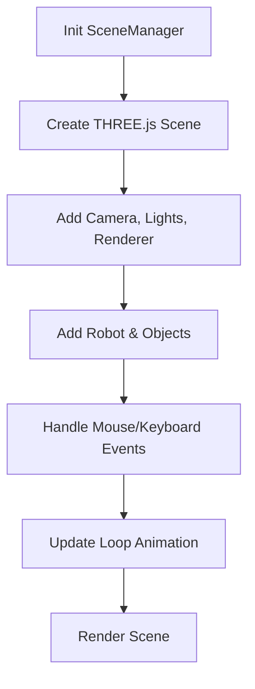

```mermaid
flowchart TD
    A[Init SceneManager] --> B[Create THREE.js Scene]
    B --> C[Add Camera, Lights, Renderer]
    C --> D[Add Robot & Objects]
    D --> E[Handle Mouse/Keyboard Events]
    E --> F[Update Loop Animation]
    F --> G[Render Scene]
```