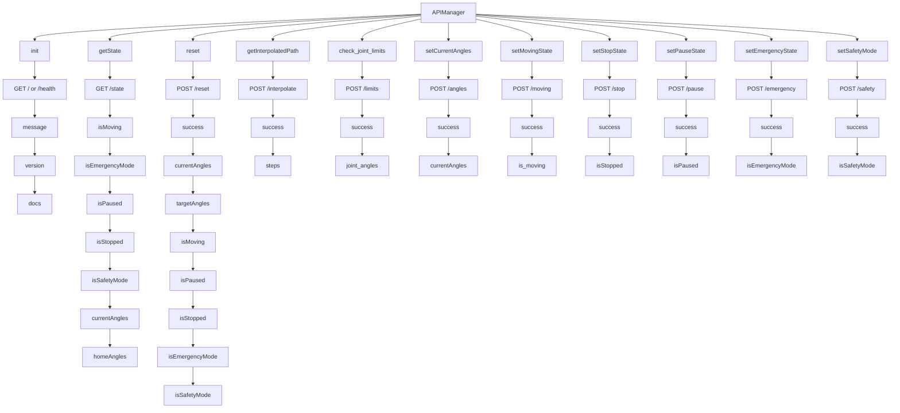

```mermaid
flowchart TD
    %% Frontend APIManager
    A[APIManager] --> B[init]
    A --> C[getState]
    A --> D[reset]
    A --> E[getInterpolatedPath]
    A --> F[check_joint_limits]
    A --> G[setCurrentAngles]
    A --> H[setMovingState]
    A --> I[setStopState]
    A --> J[setPauseState]
    A --> K[setEmergencyState]
    A --> L[setSafetyMode]

    %% APIManager calls backend endpoints
    B --> M[GET / or /health]
    C --> N[GET /state]
    D --> O[POST /reset]
    E --> P[POST /interpolate]
    F --> Q[POST /limits]
    G --> R[POST /angles]
    H --> S[POST /moving]
    I --> T[POST /stop]
    J --> U[POST /pause]
    K --> V[POST /emergency]
    L --> W[POST /safety]

    %% Returned state variables vertically
    M --> X1[message]
    X1 --> X2[version]
    X2 --> X3[docs]

    N --> Y1[isMoving]
    Y1 --> Y2[isEmergencyMode]
    Y2 --> Y3[isPaused]
    Y3 --> Y4[isStopped]
    Y4 --> Y5[isSafetyMode]
    Y5 --> Y6[currentAngles]
    Y6 --> Y7[homeAngles]

    O --> Z1[success]
    Z1 --> Z2[currentAngles]
    Z2 --> Z3[targetAngles]
    Z3 --> Z4[isMoving]
    Z4 --> Z5[isPaused]
    Z5 --> Z6[isStopped]
    Z6 --> Z7[isEmergencyMode]
    Z7 --> Z8[isSafetyMode]

    P --> AA1[success]
    AA1 --> AA2[steps]

    Q --> AB1[success]
    AB1 --> AB2[joint_angles]

    R --> AC1[success]
    AC1 --> AC2[currentAngles]

    S --> AD1[success]
    AD1 --> AD2[is_moving]

    T --> AE1[success]
    AE1 --> AE2[isStopped]

    U --> AF1[success]
    AF1 --> AF2[isPaused]

    V --> AG1[success]
    AG1 --> AG2[isEmergencyMode]

    W --> AH1[success]
    AH1 --> AH2[isSafetyMode]
```