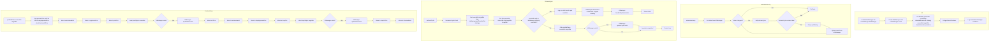

```mermaid
flowchart TD
    subgraph Init
        A1[AutomationManager init robotManager APIManager] --> A2[Create BinManager with robotManager.scene]
        A2 --> A3[Set default cycleCount cycleDelay automationInterval strategy sourceBin targetBin stepAutomation positions]
        A3 --> A4[Call getPresetPositions]
        A4 --> A5[Log Automation Manager initialized]
    end

    subgraph AutomationLoop
        L1[automationLoop] --> L2[Get state from APIManager]
        L2 --> L3{state isStopped?}
        L3 -->|Yes| L4[Exit loop]
        L3 -->|No| L5[Call performCycle]
        L5 --> L6{performCycle returns false?}
        L6 -->|Yes| L4
        L6 -->|No| L7[Sleep cycleDelay]
        L7 --> L8[Update state from APIManager]
        L8 --> L3
    end

    subgraph PerformCycle
        P1[performCycle] --> P2[Increment cycleCount]
        P2 --> P3[Get sourceBin targetBin from binManager.getTransferPair strategy]
        P3 --> P4[Set this.sourceBin sourceBin this.targetBin targetBin]
        P4 --> P5{sourceBin null or binManager.isEmpty sourceBin?}
        P5 -->|Yes| P6[Log no valid transfer pair available]
        P6 --> P7[UIManager showStatus Automation stopped warning]
        P7 --> P8[UIManager handleStopAutomation]
        P8 --> P9[Return false]
        P5 -->|No| P10[Call pickAndPlace sourceBin targetBin]
        P10 --> P11{UIManager exists?}
        P11 -->|Yes| P12[UIManager updateCycleCount]
        P12 --> P13[Log cycle completed]
        P13 --> P14[Return true]
        P11 -->|No| P13
    end

    subgraph PickAndPlace
        PP1[pickAndPlace sourceBin targetBin] --> PP2[Set approachPos pickPos liftPos dropApproachPos dropPos dropLiftPos]
        PP2 --> PP3[Move to intermediate1]
        PP3 --> PP4[Move to approachPos]
        PP4 --> PP5[Move to pickPos]
        PP5 --> PP6[robot pickObject sourceBin]
        PP6 --> PP7{UIManager exists?}
        PP7 -->|Yes| PP8[UIManager updateBinCounts]
        PP8 --> PP9[Move to liftPos]
        PP9 --> PP10[Move to intermediate1]
        PP10 --> PP11[Move to dropApproachPos]
        PP11 --> PP12[Move to dropPos]
        PP12 --> PP13[robot dropObject targetBin]
        PP13 --> PP14{UIManager exists?}
        PP14 -->|Yes| PP15[UIManager updateBinCounts]
        PP15 --> PP16[Move to dropLiftPos]
        PP16 --> PP17[Move to intermediate1]
    end
```