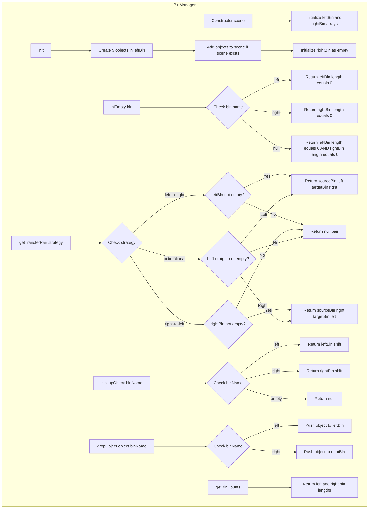

```mermaid
flowchart TD
 subgraph BinManager["BinManager"]
        B2["Initialize leftBin and rightBin arrays"]
        B1["Constructor scene"]
        B4["Create 5 objects in leftBin"]
        B3["init"]
        B5["Add objects to scene if scene exists"]
        B6["Initialize rightBin as empty"]
        B8{"Check bin name"}
        B7["isEmpty bin"]
        B9["Return leftBin length equals 0"]
        B10["Return rightBin length equals 0"]
        B11["Return leftBin length equals 0 AND rightBin length equals 0"]
        B13{"Check strategy"}
        B12["getTransferPair strategy"]
        B14{"leftBin not empty?"}
        B15["Return sourceBin left targetBin right"]
        B16["Return null pair"]
        B17{"rightBin not empty?"}
        B18["Return sourceBin right targetBin left"]
        B19{"Left or right not empty?"}
        B21{"Check binName"}
        B20["pickupObject binName"]
        B22["Return leftBin shift"]
        B23["Return rightBin shift"]
        B24["Return null"]
        B26{"Check binName"}
        B25["dropObject object binName"]
        B27["Push object to leftBin"]
        B28["Push object to rightBin"]
        B30["Return left and right bin lengths"]
        B29["getBinCounts"]
  end
    B1 --> B2
    B3 --> B4
    B4 --> B5
    B5 --> B6
    B7 --> B8
    B8 -- left --> B9
    B8 -- right --> B10
    B8 -- null --> B11
    B12 --> B13
    B13 -- "left-to-right" --> B14
    B14 -- Yes --> B15
    B14 -- No --> B16
    B13 -- "right-to-left" --> B17
    B17 -- Yes --> B18
    B17 -- No --> B16
    B13 -- bidirectional --> B19
    B19 -- Left --> B15
    B19 -- Right --> B18
    B19 -- No --> B16
    B20 --> B21
    B21 -- left --> B22
    B21 -- right --> B23
    B21 -- empty --> B24
    B25 --> B26
    B26 -- left --> B27
    B26 -- right --> B28
    B29 --> B30
```