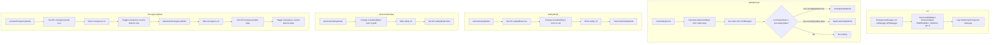

```mermaid
flowchart TD
    subgraph Init
        E1[EmergencyManager init UIManager APIManager] --> E2[Set movableObject distanceObject EMERGENCY_RADIUS api ui]
        E2 --> E3[Log Initializing Emergency Manager]
    end

    subgraph SafetyCheck
        S1[checkSafetyZone] --> S2[Calculate distanceObject from robot base]
        S2 --> S3[Get state from APIManager]
        S3 --> S4{currSafetyState != prevsafetyState?}
        S4 -->|Yes currSafetyState true| S5[activateSafetyMode]
        S4 -->|Yes currSafetyState false| S6[deactivateSafetyMode]
        S4 -->|No| S7[Do nothing]
    end

    subgraph SafetyMode
        SM1[activateSafetyMode] --> SM2[Set API safetyMode true]
        SM2 --> SM3[Change movableObject color to red]
        SM3 --> SM4[Show safety UI]
        SM4 --> SM5[DeactivateSafetyMode] 
    end

    subgraph DeactivateSafety
        DSM1[deactivateSafetyMode] --> DSM2[Change movableObject color to gold]
        DSM2 --> DSM3[Hide safety UI]
        DSM3 --> DSM4[Set API safetyMode false]
    end

    subgraph EmergencyMode
        EM1[activateEmergencyMode] --> EM2[Set API emergencyState true]
        EM2 --> EM3[Show emergency UI]
        EM3 --> EM4[Toggle emergency resume buttons true]
        EM4 --> DEM1[deactivateEmergencyMode]
        DEM1 --> DEM2[Hide emergency UI]
        DEM2 --> DEM3[Set API emergencyState false]
        DEM3 --> DEM4[Toggle emergency resume buttons false]
    end
```