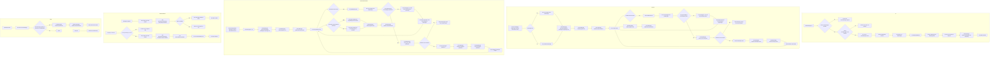

```mermaid
flowchart TD
    subgraph Init
        I1[RobotManager init] --> I2{Check sceneManager available}
        I2 -->|No| I3[Throw error SceneManager required]
        I2 -->|Yes| I4{Check sceneManager.scene available}
        I4 -->|No| I5[Throw error Scene not available]
        I4 -->|Yes| I6[Set scene = sceneManager.scene]
        I6 --> I7[Create RobotBuilder instance]
        I7 --> I8[Set builder.api = APIManager]
        I8 --> I9[Call builder.buildRobot]
        I9 --> I10[Assign robotRoot joints robotSegments]
        I10 --> I11[Convert joint rotations to degrees]
        I11 --> I12[Call UIManager updateJointDisplays with anglesDeg]
        I12 --> I13[Log robot initialized]
    end

    subgraph MoveTo
        M1[moveTo startAngles targetAngles duration manualIntervention] --> M2{startAngles null?}
        M2 -->|Yes| M3[Get currentAngles from APIManager]
        M2 -->|No| M4[Use provided startAngles]
        M3 --> M5[Call APIManager getInterpolatedPath startAngles targetAngles 30]
        M4 --> M5
        M5 --> M6[Call APIManager setMovingState true]
        M6 --> M7[Call UIManager updateAutomationStatus]
        M7 --> M8[For each path step i]
        M8 --> M9{manualIntervention false?}
        M9 -->|Yes| M10[Call waitWhilePaused]
        M10 --> M11[Get currentAngles from APIManager]
        M11 --> M12{arraysAlmostEqual currentAngles path i?}
        M12 -->|No| M13[If currentAngles1 > 50 call moveToSaferPosition]
        M13 --> M14[Recalculate path from currentAngles to targetAngles]
        M14 --> M8
        M12 -->|Yes| M15[Call APIManager check_joint_limits path i]
        M15 --> M16{limitCheck success false?}
        M16 -->|Yes| M17[Show UIManager status error Joints at limits]
        M16 -->|No| M18[Call setJointAngles path i]
        M18 --> M19[Call UIManager updateJointDisplays path i]
        M19 --> M20[Call APIManager setCurrentAngles path i]
        M20 --> M21[Sleep duration / path length]
        M21 --> M8
        M8 --> M22[Call APIManager setMovingState false]
        M22 --> M23[Call UIManager updateAutomationStatus]
    end

    subgraph MoveToSaferPosition
        S1[moveToSaferPosition startAngles duration manualIntervention] --> S2[Set saferAngles1 = 45]
        S2 --> S3[Call APIManager getInterpolatedPath startAngles saferAngles 30]
        S3 --> S4[Call APIManager setMovingState true]
        S4 --> S5[Call UIManager updateAutomationStatus]
        S5 --> S6[For each pathSafer step i]
        S6 --> S7{manualIntervention false?}
        S7 -->|Yes| S8[Call waitWhilePaused]
        S8 --> S9[Get currentAngles from APIManager]
        S9 --> S10{arraysAlmostEqual currentAngles pathSafer i?}
        S10 -->|No| S11[If currentAngles1 > 50 call moveToSaferPosition recursively]
        S11 --> S12[Recalculate pathSafer from currentAngles to saferAngles]
        S12 --> S6
        S10 -->|Yes| S13[Call APIManager check_joint_limits pathSafer i]
        S13 --> S14{limitCheck success false?}
        S14 -->|Yes| S15[Show UIManager status error Joints at limits]
        S14 -->|No| S16[Call setJointAngles pathSafer i]
        S16 --> S17[Call UIManager updateJointDisplays pathSafer i]
        S17 --> S18[Call APIManager setCurrentAngles pathSafer i]
        S18 --> S19[Sleep duration / pathSafer length]
        S19 --> S6
        S6 --> S20{automation stepAutomation pick/drop?}
        S20 -->|drop| S21[Call moveTo pathSafer i targetBinApproach duration]
        S20 -->|pick| S22[Call moveTo pathSafer i sourceBinApproach duration]
        S21 --> S23[Call APIManager setMovingState false]
        S22 --> S23
        S23 --> S24[Call UIManager updateAutomationStatus]
    end

    subgraph PickDropObjects
        P1[pickObject binName] --> P2[Sleep 500ms simulate gripper]
        P2 --> P3[Call automation.binManager pickupObject binName]
        P3 --> P4{Object available?}
        P4 -->|Yes| P5[Call attachObjectToRobot object]
        P4 -->|No| P6[Throw error No objects in bin]
        P5 --> P7[Log object picked]
        
        D1[dropObject binName] --> D2{CurrentlyHeldObject exists?}
        D2 -->|No| D3[Throw error No object to drop]
        D2 -->|Yes| D4[Sleep 500ms simulate gripper]
        D4 --> D5[Call automation.binManager dropObject object binName]
        D5 --> D6[Call detachObjectFromRobot]
        D6 --> D7[Set currentlyHeldObject null]
        D7 --> D8[Log object dropped]
    end

    subgraph Utility
        U1[waitWhilePaused] --> U2[Get state from APIManager]
        U2 --> U3{state isEmergencyMode or isPaused or isSafetyMode?}
        U3 -->|Yes| U4[Call APIManager setMovingState false]
        U4 --> U5[Update UIManager updateAutomationStatus]
        U5 --> U6[Sleep 100ms then repeat]
        U3 -->|No| U7[Return]
        
        U8[sleep ms] --> U9[Wait for ms milliseconds]
    end
```