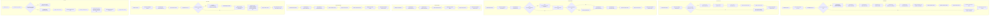

```mermaid
flowchart TD
    subgraph ResetScene
        A[handleResetScene] --> B[Show status Restarting scene info]
        B --> C[Call APIManager reset]
        C --> D{Does sceneManager reset exist}
        D -->|Yes| E[Call APIManager setCurrentAngles resetData targetAngles]
        E --> F[Call APIManager setMovingState false]
        F --> G[Call APIManager setPauseState false]
        G --> H[Call APIManager setStopState false]
        H --> I[Call APIManager setEmergencyState false]
        I --> J[Call APIManager setSafetyMode false]
        J --> K[Update joint displays with resetData currentAngles]
        K --> L[Update automation status]
        L --> M[Update automation buttons]
        M --> N[Toggle override controls]
        N --> O[Call robot sceneManager reset]
        D -->|No| P[Throw error Scene reset method not available]
        O --> Q[Show status Scene reset success]
        P --> Q
    end

    subgraph StartAutomation
        SA[handleStartAutomation] --> SB[Show status Starting automation info]
        SB --> SC{Check if automation binManager is empty}
        SC -->|Yes| SD[Throw error No objects to move reset the scene first]
        SC -->|No| SE[Call APIManager setMovingState true]
        SE --> SF[Reset automation cycleCount to 0]
        SF --> SG[Call automation automationLoop]
        SG --> SH[Update automation buttons]
        SH --> SI[Toggle override controls]
        SI --> SJ[Show status Automation Starting success]
        SD --> SJ
    end

    subgraph StopAutomation
        STA[handleStopAutomation] --> STB[Show status Stopping automation info]
        STB --> STC[Call APIManager setStopState true]
        STC --> STD{Does automationLoopPromise exist}
        STD -->|Yes| STE[Await automationLoopPromise completion]
        STE --> STF[Set automationLoopPromise null]
        STD -->|No| STF
        STF --> STG{Does automationInterval exist}
        STG -->|Yes| STH[Clear automationInterval]
        STG -->|No| STI[Call APIManager setMovingState false]
        STH --> STI
        STI --> STJ[Call APIManager setStopState false]
        STJ --> STK[Update automation buttons]
        STK --> STL[Toggle override controls]
        STL --> STM[Show status Automation stopped warning]
    end

    subgraph PauseAutomation
        PA[handlePauseAutomation] --> PB[Call APIManager setPauseState true]
        PB --> PC[Call APIManager setMovingState false]
        PC --> PD[Update automation status]
        PD --> PE[Update pause resume buttons]
        PE --> PF[Toggle override controls]
        PF --> PG[Show status Automation paused success]
    end

    subgraph ResumeAutomation
        RA[handleResumeAutomation] --> RB[Call APIManager setPauseState false]
        RB --> RC[Call APIManager setMovingState true]
        RC --> RD[Update automation status]
        RD --> RE[Toggle override controls]
        RE --> RF[Update automation buttons]
        RF --> RG[Update pause resume buttons]
        RG --> RH[Show status Automation resumed success]
    end

    subgraph ResetJoints
        RJA[handleResetJoints] --> RJB[Show status Resetting robot info]
        RJB --> RJC[Call APIManager setMovingState true]
        RJC --> RJD[Toggle override controls]
        RJD --> RJE[Call APIManager reset]
        RJE --> RJF{If resetData currentAngles 1 > 50}
        RJF -->|Yes| RJG[Call robot moveToSaferPosition resetData currentAngles]
        RJG --> RJH[Call APIManager getState]
        RJH --> RJI[Update resetData currentAngles with state currentAngles]
        RJF -->|No| RJI
        RJI --> RJJ[Call robot moveTo resetData currentAngles resetData targetAngles 1000 manualIntervention true]
        RJJ --> RJK[Toggle override controls]
        RJK --> RJL[Show status Robot reset to home position success]
    end

    subgraph SetJoints
        SJA[handleSetJoints] --> SJB[Call APIManager getState]
        SJB --> SJC{If state isEmergencyMode or state isSafetyMode}
        SJC -->|Yes| SJD[Show status Robot in emergency or safety error]
        SJC -->|No| SJE[Call APIManager setMovingState true]
        SJE --> SJF[Toggle override controls]
        SJF --> SJG[Read joint input values a1 to a6]
        SJG --> SJH[Update joint display values]
        SJH --> SJI[Call robot moveTo state currentAngles jointAngles 1000 manualIntervention true]
        SJI --> SJJ[Show status Joint angles set success]
        SJJ --> SJK[Toggle override controls]
    end
```